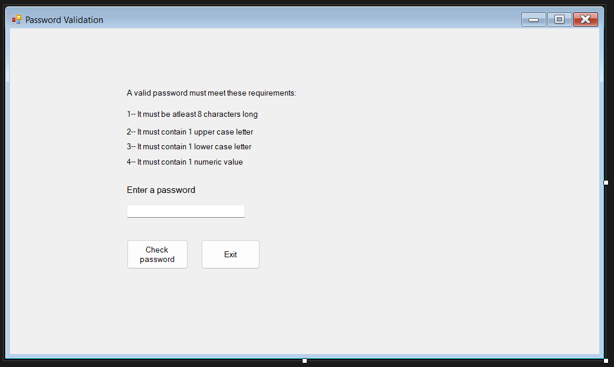

# Simple Password Validation Program

This repository contains a **Password Validation Program** built using C#. The project demonstrates fundamental C# programming concepts, focusing on user input validation and string manipulation to ensure secure password creation.

## About the Project

The **Password Validation Program** was created to:
- Provide users with feedback on the strength and validity of their passwords.
- Demonstrate best practices in user input validation and error handling.
- Serve as a beginner-friendly example of C# programming with practical applications.

## Features
- **Password Validation**:
  - Checks for password complexity (e.g., length, use of uppercase, lowercase, numbers, and special characters).
  - Ensures passwords meet specific security criteria.
- **User Feedback**:
  - Provides detailed feedback on why a password is invalid.
- **Interactive Console Interface**:
  - Allows users to input passwords and receive immediate feedback.

## What I Did
- **Validation Logic**:
  - Implemented rules for validating passwords, such as minimum length and character diversity.
- **Error Handling**:
  - Added robust checks for invalid inputs and displayed meaningful error messages.
- **User Interaction**:
  - Designed a console-based UI for user-friendly interaction.

## What I Learned
- Gained hands-on experience in implementing input validation logic.
- Enhanced understanding of string manipulation in C#.
- Practiced structuring simple yet effective console applications.
- Improved error handling and feedback mechanisms.

## Screenshots



## Technologies Used
- **C#**
- **.NET Framework**

## How to Run
1. Clone the repository:
   ```bash
   git clone https://github.com/<your-username>/PasswordValidation.git
